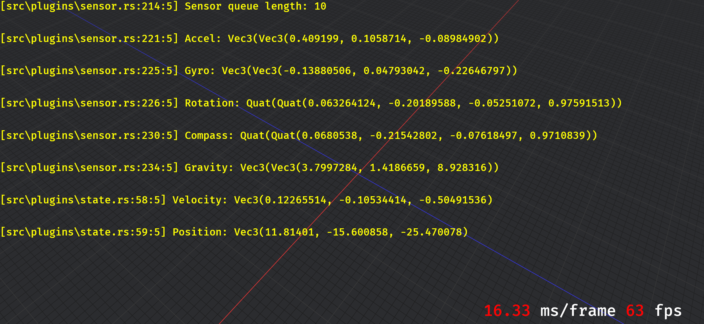

## Android Position Estimator

An Android app that performs numerical integration to estimate a device's real-time position.



### Project setup

- Install [Android Studio](https://developer.android.com/studio)
- Install [Rust](https://www.rust-lang.org/learn/get-started)
- Install build toolchains for Android

```bash
rustup target add aarch64-linux-android x86_64-linux-android
```

- Install [cargo-ndk](https://github.com/bbqsrc/cargo-ndk)

```bash
cargo install cargo-ndk
```

- Specify path to NDK by setting `ANDROID_NDK_HOME` env variable
- Install [sscache](https://github.com/mozilla/sccache) for significantly shorter build time

```bash
cargo install sccache --locked
```

- Define build.rustc-wrapper in the cargo configuration file. Add the following to `$HOME/.cargo/config.toml` or `%USERPROFILE%\.cargo\config.toml`:

```toml
[build]
rustc-wrapper = "~/.cargo/bin/sccache"
```

### Build

Android build is managed by [rust-android-gradle](https://github.com/mozilla/rust-android-gradle). Simply click `Run 'app'` in Android Studio.

It is essentially running the following commands under the hood:

```bash
cargo ndk -t arm64-v8a -o app/src/main/jniLibs/  build
./gradlew.bat build
./gradlew.bat installDebug
adb shell am start -n com.mrjohn6774.androidpositionestimator/.MainActivity
```

Build and run on desktop

```bash
cargo run --features="desktop"
```
